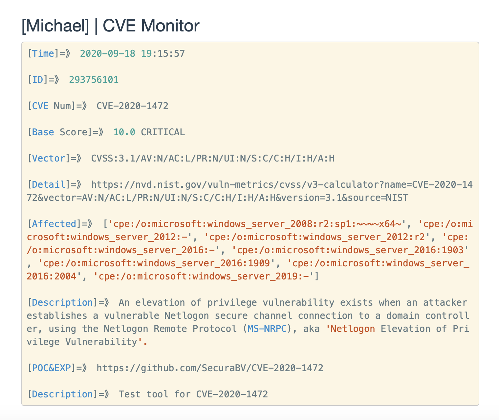

# CVE Monitor From Github|NVD Send By Server酱

[python3]

1、pip install requirements.txt

2、Change the "SCKEY" to your own

3、First run, Pay attention to the "total" value Settings

4、nohup python -u CVE_Monitor.py > output.log 2>&1 &

5、Running continuously, WeChat receives notifications

